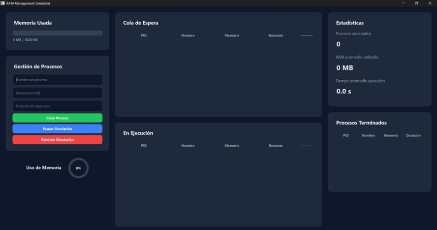
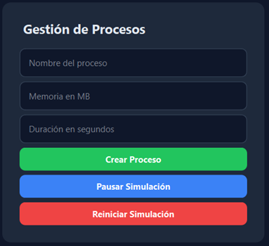
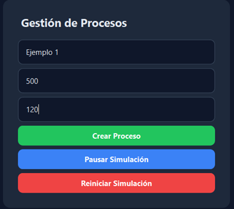
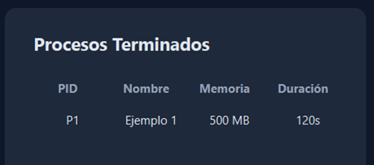
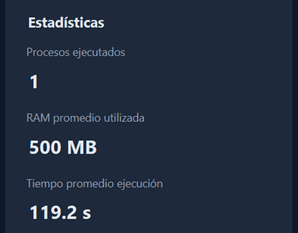
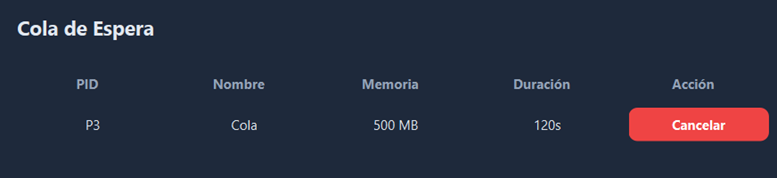
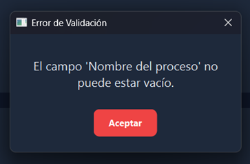
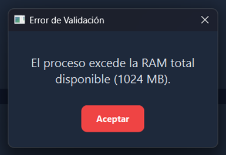

Introducción general

Este programa tiene como objetivo representar cómo un sistema operativo administra dinámicamente la memoria RAM al ejecutar procesos. El simulador trabaja con una memoria limitada de 1 GB y una CPU, permitiendo crear procesos con parámetros como PID, nombre, memoria requerida y duración.
La aplicación permite ejecutar varios procesos de forma simultánea mientras haya memoria disponible, y gestiona una cola de espera para los procesos que no puedan ejecutarse de inmediato. Al finalizar un proceso, su memoria se libera automáticamente. Además, se muestra en tiempo real el estado de la memoria y los procesos activos.

Requisitos del sistema

Requisitos de Software

Sistema Operativo: Compatible con la mayoría de sistemas operativos modernos.
Windows 10 o superior
macOS 10.15 (Catalina) o superior
Cualquier distribución de Linux reciente (como Ubuntu 20.04+, Fedora 34+, etc.)
Intérprete de Python: Versión 3.8 o superior.
Bibliotecas de Python (Dependencias):
PySide6: Es la dependencia principal para que toda la interfaz gráfica funcione. Se puede instalar fácilmente usando pip install pyside6.

Requisitos de Hardware

Dado que la aplicación es una simulación visual y no realiza cálculos extremadamente intensivos, los requisitos de hardware son bastante modestos.
Procesador (CPU): Cualquier procesador moderno de doble núcleo (Intel Core i3, AMD Ryzen 3 o superior) es más que suficiente.
Memoria RAM: Se recomienda un mínimo de 4 GB de RAM para que el sistema operativo y la aplicación se ejecuten cómodamente.
Espacio en Disco: Menos de 200 MB para la instalación de Python y las bibliotecas necesarias.
Estructura del proyecto
 
GestorRam	Carpeta principal que contiene el código.
_pycache_	Guarda versiones compiladas de código en Python.
venv	Contiene el entorno virtual de Python para aislar las dependencias de proyecto.
core.py	Simulador de gestión de procesos en memoria RAM con ejecución concurrente, cola de espera y estadísticas en tiempo real.
gui.py	Interfaz gráfica en PySide6 para simular y visualizar en tiempo real la gestión dinámica de procesos y memoria RAM.
main.py	Punto de entrada del simulador: lanza la interfaz gráfica principal y ejecuta la aplicación.
requirements.txt	Son los requerimientos para correr el programa, si no los tienes se instalan escribiendo en consola “pip install PySide6” o “pip install -r requirements.txt”.

Descripción principal (Gestor RAM)
core.py
Este archivo contiene la lógica central del simulador, es decir cómo se comporta internamente el sistema de gestión de procesos. 
•	Proceso: representa cada proceso individual (con PID, memoria, duración, estado, etc.).
•	GestorMemoria: se encarga de asignar y liberar la memoria RAM de forma dinámica.
•	Simulador: coordina todo el sistema: agrega procesos, los ejecuta si hay memoria disponible, gestiona la cola de espera, libera memoria al finalizar, y actualiza estadísticas.

gui.py

Este archivo implementa la gui del simulador usando PySide6.
•	La ventana principal (MainWindow), con un diseño dividido en paneles (memoria, procesos, estadísticas, etc.).
•	Widgets personalizados como una barra de progreso circular para visualizar el uso de RAM.
•	Controles de usuario como botones para crear procesos, pausar/reanudar la simulación, reiniciar todo, etc.
•	Las tablas que muestran procesos en cola, en ejecución y finalizados.
•	Conexión directa con la lógica de core.py para visualizar y controlar el comportamiento del simulador.

main.py

Este archivo es el punto de entrada del programa.
•	Inicializa la aplicación Qt (QApplication).
•	Crea e inicia la ventana principal (MainWindow del archivo gui.py).
•	Lanza el bucle principal del programa con app.exec().

Librerías

•	uuid
Genera identificadores únicos universales, los cuales son números de 128 bits únicos en cualquier contexto útiles para identificar registros.
•	random
Proporciona herramientas para generar números y secuencias, fundamental para simulaciones.
•	time
Nos proporciona funciones para trabajar con tiempo, como obtener la hora, fecha o medir la duración de un proceso.
•	threading
Crea y gestiona hilos de ejecución lo que permite varias tareas realizadas al mismo tiempo, lo que mejora el rendimiento en o
•	sys
Otorga acceso a funciones del sistema o de Python, lo cual permite interactuar con el entorno de ejecución.
•	math
Proporciona funciones relacionadas con procesos matemáticas tales como cálculos de logaritmos, funciones trigonométricas, contantes, etc.
•	deque
Pertenece al modulo “collections” y es una cola de dos extremos (double-enden queue).

Librerías externas

•	QtWidgets
Modulo para crear componentes visuales de una aplicación de escritorio, es decir que contiene botones, ventanas, menús, campos de entrada, etc.
•	QtCore
Proporciona la funcionalidad de el framework Qt, el cual contiene un bucle de eventos el cual es el responsable de que la aplicación se encuentre en ejecución y interactúe con el usuario.
•	QtGui
Integra el sistema grafico del SO, maneja renderización de ventanas, formas, gestión de imágenes, etc. Funciona como un enlace entre los widgets abstractos de QtWidgets y lo que se muestra en pantalla.

Clases y funciones

core.py
•	class Proceso
Esta clase funciona como un “ladrillo” debido a que cada objeto creado a partir de esta clase es una simulación de un proceso real, es decir que funciona como un molde para objetos que representen un proceso de computadora, su objetivo principal es almacenar información relevante de un proceso individual.
Iniciamos la clase con el constructor __init__ el cual es ejecutado cada vez que creamos un nuevo objeto/proceso con el fin de inicializar el mismo con sus atributos.
1.	 self.pid = pid
Asigna un identificador de proceso (PID) el cual es un número único para identificar al proceso (dato que es obligatorio al crear un objeto).
2.	self.nombre = nombre if nombre else f"Proceso-{self.pid}"
Si se le pasa un nombre lo usa, Si no, crea un nombre genérico usando “Proceso”.
3.	self.memoria_mb = memoria_mb if memoria_mb else random.randint(50, 250)
Define la cantidad de memoria RAM que el proceso necesita en megabytes, en este caso es un valor aleatorio entre 50 y 250.

4.	self.duracion_s = duracion_s if duracion_s else random.randint(5, 20)
Establece la duración que el proceso necesita para completarse.

5.	self.tiempo_restante = self.duracion_s
Crea un "contador" que indica cuánto tiempo de ejecución le queda. Al inicio, es igual a su duración total. Este valor disminuirá a medida que el proceso se "ejecute" en el simulador.

6.	self.estado = "Listo"
Fija el estado inicial del proceso como "Listo" (Ready).

7.	self.tiempo_inicio = None y self.tiempo_fin = None
Son marcadores de tiempo los cuales se inician vacíos porque el proceso aun no ha comenzado ni terminado.

8.	self.tiempo_duracion_real = 0
Almacena el tiempo real que tardó el proceso desde que inició hasta que finalizó, incluyendo posibles tiempos de espera.

•	class GestorMemoria

Guarda los recursos de la memoria en la simulación, lo único que maneja es cuanta memoria necesita un proceso y cuanta devuelve.
Contiene 2 métodos:
1.	asignar_memoria
utiliza “with self.lock” lo que hace que antes de iniciar cualquier proceso se cierre el candado lo cual bloquea el acceso a otros hilos, luego vamos a “if self.memoria_disponible >= proceso.memoria_mb:	” lo cual  comprueba si la memoria libre es suficiente para el proceso que se solicita; si hay espacio suficiente lo resta de la memoria total y si no hay espacio devuelve un “false” indicando que la asignación de memoria fallo.
2.	liberar_memoria
En este proceso recuperamos la memoria de un proceso finalizado, iniciamos con lo mismo “with self.lock” y luego vamos a “self.memoria_disponible += proceso.memoria_mb” lo que suma la cantidad de memoria devuelta por un proceso a la memoria disponible.
•	class Simulador
La clase simulador se encarga de unir y coordinar las clases anteriores, lo cual crea una simulación de SO, gestionando totalmente el ciclo de vida de los procesos.
Inciando con “self.gestor_memoria = GestorMemoria()” crea una instancia del gestor de memoria (tiene la tarea de administrar RAM). Mientras que “self.cola_espera = []” es la lista de los objetos que se encuentran en espera, “self.procesos_en_ejecucion = {}” los procesos que se encuentran en ejecución y “self.procesos_terminados = []” los procesos finalizados de forma natural.
Para el control de la simulación “self.proceso_id_counter = 0” es un contador para asignar un ID único a cada nuevo proceso, “self.ejecutando = False y self.pausado = False” controlan el estado de un proceso, lo que significa que ven si está corriendo o está detenido.
Parte importante de la simulación es la ejecución, por eso “self.hilo_ejecucion = threading.Thread(...)” crea un hilo de ejecución secundario lo que significa que la simulación correrá en segundo plano, permitiendo que la interfaz de usuario o cualquier parte del programa siga respondiendo sin congelarse.
El método más importante de esta clase es “ejecutar_simulacion” ya que se compone de las siguientes partes:

1.	Bucle Constante
while self.ejecutando› se ejecuta sin parar.
2.	Pausa
Si self.pausado es “true” no hace nada, lo que significa que la simulación se va a pausar, de lo contrario seguirá sin pausarse.
3.	Ciclo de Reloj (Cada Segundo)
Con time.sleep(1), las siguientes acciones ocurren una vez por segundo:
•	Para cada proceso en ejecución, le resta 1 a su tiempo_restante.
•	Si el tiempo_restante de un proceso llega a 0, lo considera "Terminado".
•	Cuando un proceso termina, libera su memoria (llamando a self.gestor_memoria.liberar_memoria), lo mueve de la lista de ejecución a la de terminados y actualiza las estadísticas.
•	Llama a intentar_ejecutar_procesos para ver si la memoria liberada permite que algún proceso en la cola_espera pueda empezar a correr.
Ahora, para la gestión de procesos y el control del programa (interacción programa-usuario) se usa lo siguiente › “agregar_proceso(proceso)” añade un nuevo proceso a la cola_espera, “intentar_ejecutar_procesos()” revisa la cola de espera y, si hay memoria disponible, mueve el proceso a la lista de ejecución, “iniciar_simulacion()” inicia el hilo secundario, poniendo en marcha el bucle “ejecutar_simulacion”, “pausar_simulacion()” y “reanudar_simulacion()” cambian el valor de la bandera “self.pausado” para detener o continuar el bucle, funcionando como una puerta.

gui.py

•	class CircularProgressBar
Siendo aspectos de la gui, usa principalmente las librerías de PyQt o PySide; adentrándonos a la clase, podemos observar que la funcionalidad principal es crear un widget que muestra el progreso, en este caso una barra circular para finalmente colocar el porcentaje actual de memoria usada en el centro. Los puntos más importantes de esta clase son:
	setValue(self, value) – encargado del progreso
	paintEvent(self, event) – encargado de la parte visual

•	class CustomErrorDialog
Crea una ventana de dialogo personalizada. Los puntos importantes o a resaltar de esta clase son que obliga al usuario a reconocer el error usando “setModal(True)” forzando a presionar aceptar evitando que se ignoren errores del programa.
•	class MainWindow
En esta clase se define la ventana principal de la aplicación además de que organiza todos los elementos visuales que la componen tales como botones, paneles, gráficos, etc. 
Sus puntos más importantes son:
-	La clase MainWindow que se centra en mostrar la información y capturar la entrada del usuario. Toda la lógica compleja de la simulación va en la clase “Simulador” la Vista envía comandos al Modelo (crear_proceso) y pide datos para mostrar.
-	El uso de un QTimer para llamar periódicamente a actualizar_ui es el mecanismo que permite que la interfaz refleje cambios constantes sin congelarse ni requerir la intervención del usuario.
-	El uso del método _actualizar_tabla para insertar QPushButton permite crear interfaces de datos donde el usuario puede actuar sobre elementos individuales de una lista.
Ejecución
1.	Descomprimir el archivo ZIP
•	Extrae el contenido del archivo .zip en la ubicación de tu preferencia.
2.	Abrir el proyecto en Visual Studio Code
•	Abre Visual Studio Code.
•	Selecciona Archivo > Abrir carpeta... y elige la carpeta que contiene los archivos del proyecto (descomprimidos).
3.	Crear y activar un entorno virtual
•	En terminal (dentro de VS Code o externa):
bash
CopiarEditar
python -m venv venv
•	Activar el entorno:
En Windows:
venv\Scripts\activate
	En macOS/Linux:
source venv/bin/activate
4.	Instalar las dependencias
•	Colócate en la carpeta del proyecto y en la terminal escribe
pip install -r requirements.txt
Esto instalará las librerías necesarias, como PySide6, para que la interfaz gráfica funcione correctamente.
5.	Ejecutar el simulador
•	El archivo main.py debe de estar seleccionado en el editor.
•	El programa se ejecuta con el siguiente script:
python main.py
•	También puedes usar el botón “Run”.

Recomendaciones y mejoras futuras

1.	Persistencia de datos
•	Implementar un sistema de guardado (por ejemplo, en JSON o SQLite) para conservar el historial de procesos ejecutados, incluso después de cerrar la aplicación.
•	Posibilidad de cargar un conjunto de procesos predefinidos al iniciar.
2.	Ajustes de sistema configurables
•	Permitir modificar dinámicamente la cantidad total de RAM disponible desde la interfaz.
•	Agregar opciones para simular múltiples CPUs o núcleos.
3.	Mejoras visuales y de accesibilidad
•	Incluir gráficos estadísticos (como barras o líneas) que muestren la evolución del uso de RAM a lo largo del tiempo.
•	Añadir temas claro/oscuro y soporte para diferentes idiomas.
4.	Mejor gestión de procesos
•	Prioridades: integrar un sistema de prioridades que influya en la ejecución de procesos.
•	Suspensión y reanudación manual de procesos individuales.
•	Visualización del tiempo exacto de inicio y finalización de cada proceso.
5.	Modularización avanzada
•	Separar la lógica de UI en archivos o módulos adicionales para mantener una arquitectura más limpia y escalable.
6.	Exportación de resultados
•	Permitir exportar estadísticas de uso de memoria y procesos ejecutados en formato PDF, CSV o Excel para análisis externo.
7.	Compilación como ejecutable
•	Empaquetar el proyecto como una aplicación independiente (.exe, .app) usando herramientas como PyInstaller, para facilitar su distribución sin necesidad de Python.

Pruebas

Pantalla principal

Se nos muestra una pestaña que nos muestra las funciones principales del programa para gestionar la memoria.

Gestión de procesos

La ventana de gestión de procesos contiene 3 casillas a llenar acompañada de 3 botones, a continuación, el uso correcto para llenar el formulario que seguidamente creara un proceso.
                        

Proceso en ejecución

En esta ventana se mostrarán los procesos solicitados, tomando en cuenta la imagen anterior se observa que el proceso creado anteriormente está en ejecución.

Detalles de proceso

Al lado de la ventana de ejecución podemos observar detalles del proceso anterior, como características básicas y las estadísticas de uso.

Uso de memoria

El uso de memoria se mostrará en base a el máximo de memoria autorizada, además de contar con una función que demuestre cuanto porcentaje esta se esta usando.

Cola

Si varios procesos superan la memoria autorizada, se esperará a que terminen los procesos ocupantes de memoria y se coloca en cola a la espera de liberación de memoria.

Errores o validaciones

Comenzando con la ventana “Gestión de procesos” si asignamos un valor nulo dentro de las casillas (es decir que no colocamos nada) nos devuelve la siguiente ventana.

Lo mismo sucede cuando queremos pasarnos de la cantidad asignada de memoria RAM.

 
